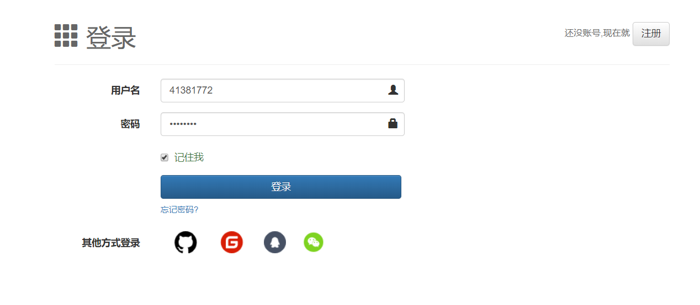
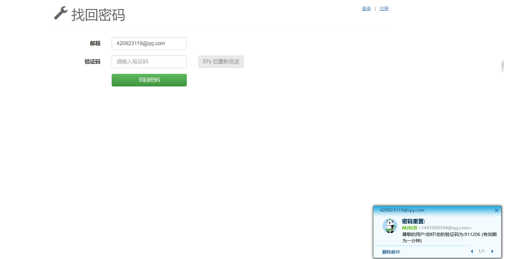
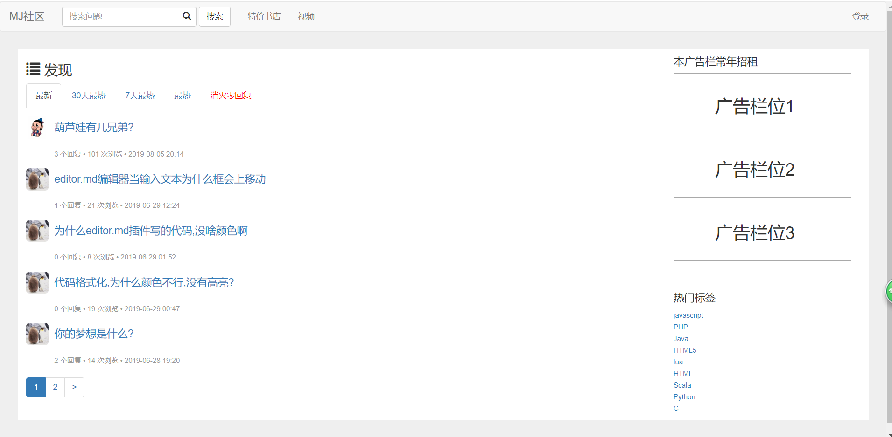
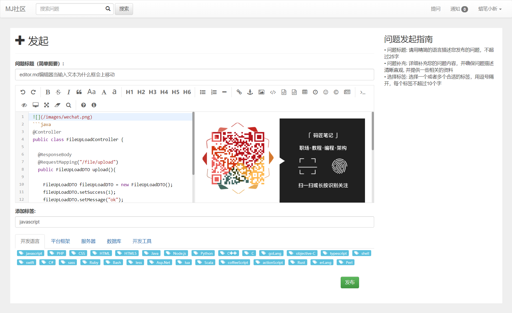
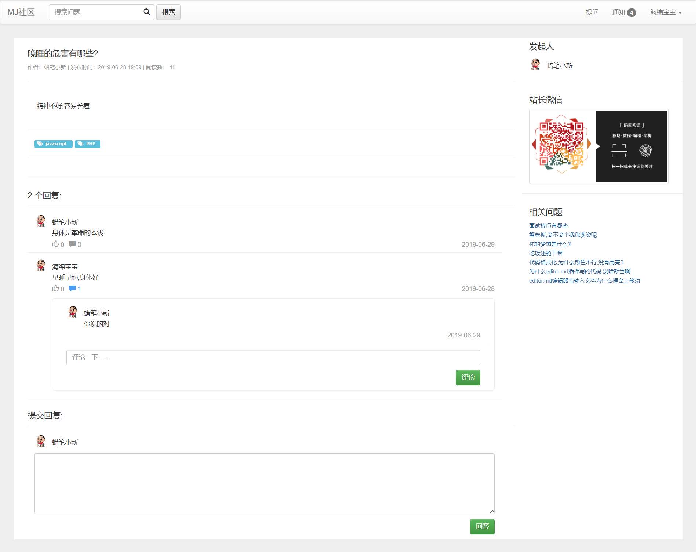
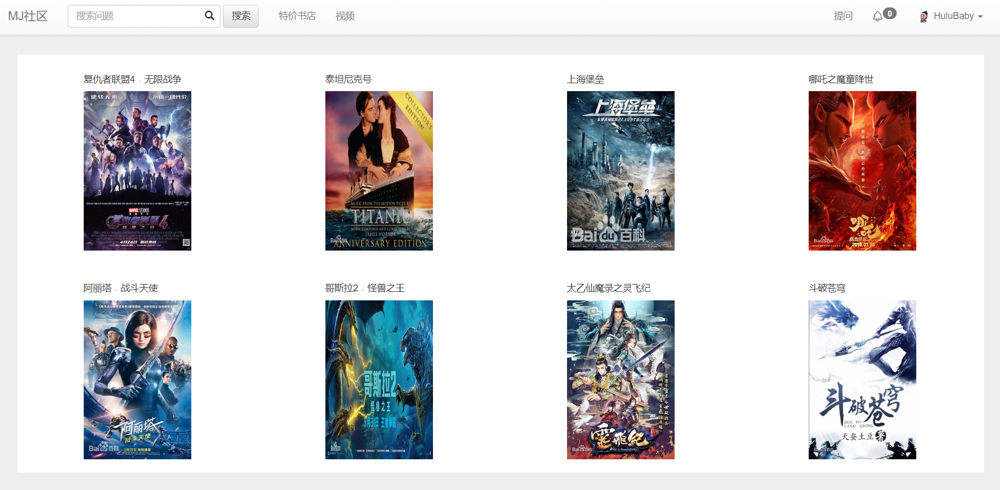
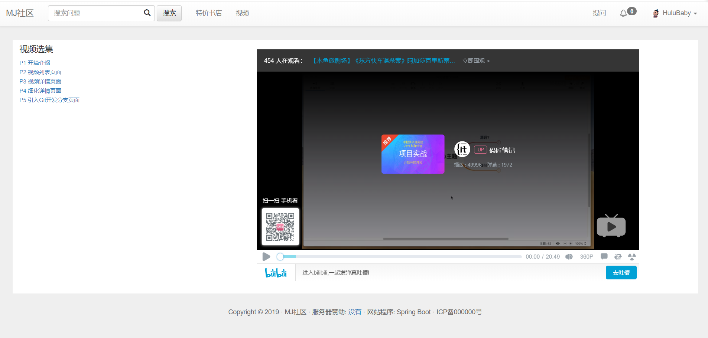
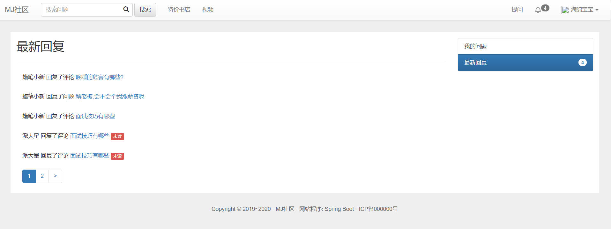
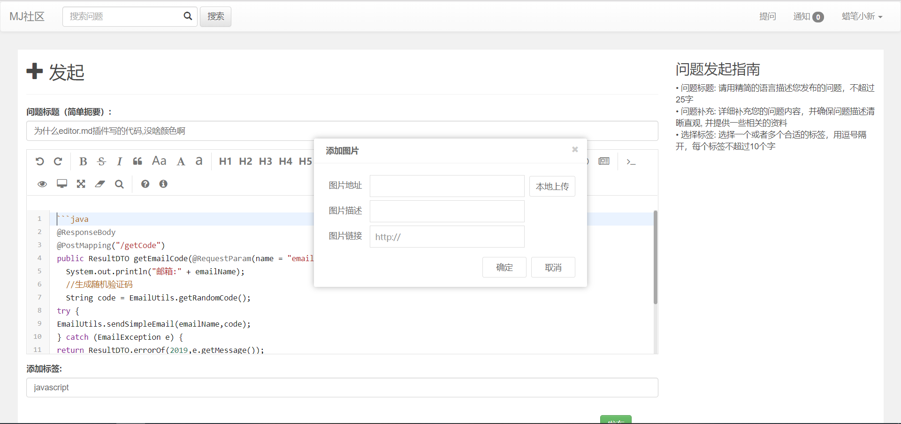

## 在线文档
+ [https://www.showdoc.cc/majiangdoc?page_id=2362238912918825](https://www.showdoc.cc/majiangdoc?page_id=2362238912918825)


## 一、准备工作
```
JDK >= 1.8 (推荐1.8版本)
Mysql >= 5.5.0 (推荐5.7版本)
Maven >= 3.0
IntelliJ IDEA 2019.1.2
```
## 二、使用技术
### 2.1 前端
+ `Bootstrap`
+ `Editor.md`
+ `Layer`
+ `Thymeleaf`
### 2.2后台
+ `SpringBoot`
+ `SpringMVC`
+ `Mybatis`
+ `Maven`
+ `Redis`
+ `Github OAuth2`
+ `OKHttp3`
+ `LomBok`
+ `H2 database`
+ `Flayway`

## 三、文件结构
```
majiang
├── com.xlx.majiang
│       	└── advice                    // 异常事务
│       	└── cache                     // 常量
│       	└── controller                // 控制层
│       	└── dto                       //数据对象
│       	└── enums                     // 通用枚举
│       	└── exception                 // 通用异常
│       	└── interceptor               // 拦截器
│       	└── utils                     // 通用类处理
│       	└── mapper                    // mybatis generator生成的mapper文件
|
|
├── recesources         // 资源
│       └── db.migration              // Flyway管理的sql脚本
│       └── mapper                    //  mybatis generator生成的XXX.xml数据库操作文件
│       └── static                    // 静态资源
│       └── templates                 // 模板文件
|
|
├── test   // 单元测试
├── MajiangApplication.java      // 项目启动入口
├── application.properties      // 配置文件
|
|-------其他
```

## 四、 GitHub oauth2认证的过程
### 第一步: 点击第三方登录,认证
  > GET:    https://github.com/login/oauth/authorize?

需要参数 | 描述
:----:|:-----:
`client_id`|github API给定id(String)
`redirect_uri`|认证成功返回的url(String)
`scope`|获取资源信息范围,user用户,repo仓库(String)
`state`|随机字符串(String)


### 第二步: 初次会让你确认是否授权,是,然后会让你登录Github

### 第三步: 登录成功后,会返回你指定的redirect_uri,携带参数code,state

### 第四步: 继续向github请求获取token
  > POST:    https://github.com/login/oauth/access_token

需要参数 | 描述
:----:|:-----:
`client_id`|github API给定id(String)
`client_secret`|github API 给定的secret(String)
`redirect_uri`|认证成功返回的url(String)
`scope`|获取资源信息范围,user用户,repo仓库(String)
`state`|随机字符串(String)
`code`|返回的code(String)

### 第五步: 获取token后,用于请求获取GitHub的用户信息
  > GET:    https://api.github.com/user?

需要参数 | 描述
----|:-----
`access_token`|从github那里获取的token(String)

## 五、表设计
### 5.1  user表/用户
字段|	属性|	描述
:--------:|:----:|:-----
id|	bigint|	主键自增,Long
acount_id|	varchar100|	第三方账号id,String
name|	varchar50|	第三方账号名称,String
avatar_url|	varchar100|	第三方账号头像图片ur,Stringl
token|	varchar36|	密钥,cookie访问,String
gmt_create|	bigint|	创建时间,Long
gmt_modified|	bigint|	修改时间,Long

### 5.2 question表/问题
字段|	属性|	描述
:--------:|:----:|:-----
id|	bigint|	主键自增,Long
title|varchar50|问题标题,String
description|text|问题内容,String
comment_count|int10|评论数量,String
view_count|int10|浏览数量,Integer
like_count|int10|点赞数量,Integer
tag|varchar256|标签,(标签样式),String
creator|bigint|提问题的人,Long
gmt_create|	bigint|	创建时间,Long
gmt_modified|	bigint|	修改时间,Long

### 5.3 notification表/消息通知
字段|	属性|	描述
:--------:|:----:|:-----
id|	bigint|	主键自增,Long
notifier|bigint|发送通知人id,Long
notifier_name|varchar50|发送通知人的姓名,String`①XXX某某某`
receiver|bigint|接收通知人,Long`回复了谁发的问题,谁发的评论id`
outer_id|	bigint|问题id`问题id,得到title`
type|int10|通知类型,1:回答了问题,2:回复了评论,Integer `②回答了问题/回复了评论`
status|int10|通知状态,默认0:未读,1:已读,Integer`标记问题状态,如未读红色标记`
outer_title|varchar256|问题的标题,String`③问题[为什么离职]`
gmt_create|	bigint|	创建时间,Long
gmt_modified|	bigint|	修改时间,Long


### 5.4comment/评论,提问表
字段|	属性|	描述
:--------:|:----:|:-----
id|	bigint|	主键自增,Long
parent_id|bigint|问题/一级评论id,Long
type|int10|类型,Integer`回答该问题1或评论该问题的回答2`
commentator|bigint|用户id,Long`谁回答?,谁评论的?`
comment|varchar1024|回答内容,String`评论内容`
comment_count|int|回复统计,默认0`你发表的多少人回复你`
like_count|int|点赞统计
gmt_create|	bigint|	创建时间,Long
gmt_modified|	bigint|	修改时间,Long


## 六、 项目演示

+ URL: http://localhost:8887/ 
+ 账户1: 41381772 密码:41381772
+ 账户2: 41381773 密码:41381773
+ 账户3: 41381774 密码:41381774
<table>
<tr>
  <td></td>

  <td></td>
</tr>
<tr>
  <td></td>
  <td></td>
</tr>
<tr>
  <td></td>
  <td></td>
</tr>
<tr>
  <td></td>
  <td></td>
</tr>
<tr>
  <td></td>
  <td></td>
</tr>
</table>

## 七、 Contributor
[@猕猴桃](https://github.com/XielinX)
